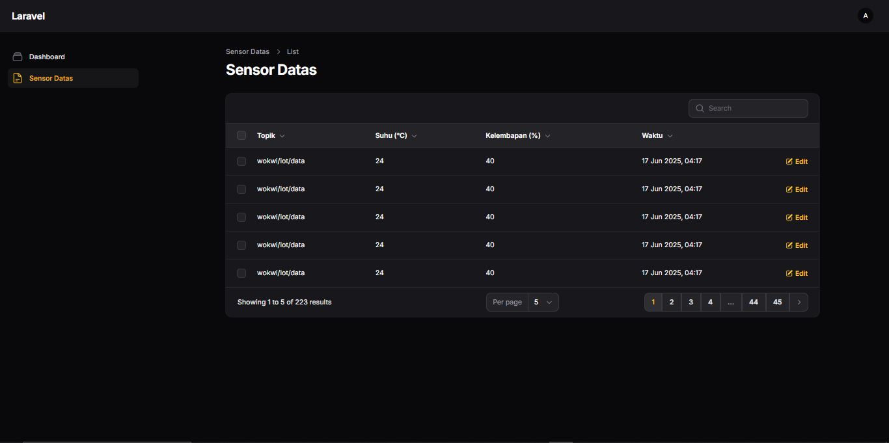

Berikut adalah **full `README.md`** untuk proyek Laravel IoT Dashboard milikmu — sudah lengkap dengan deskripsi, fitur, teknologi yang digunakan, format data MQTT, gambar, serta petunjuk instalasi:

---

````markdown
<p align="center">
  <a href="https://laravel.com" target="_blank">
    
  </a>
</p>

<p align="center">
  <a href="https://github.com/laravel/framework/actions"></a>
  <a href="https://packagist.org/packages/laravel/framework"></a>
  <a href="https://packagist.org/packages/laravel/framework"></a>
  <a href="https://packagist.org/packages/laravel/framework"></a>
</p>

---

## 📡 Laravel IoT Monitoring Dashboard

Sistem pemantauan suhu dan kelembapan secara real-time menggunakan **Laravel** dan **MQTT**, dengan visualisasi data melalui panel admin **Filament**. Data dikirim dari perangkat **ESP32 (simulasi Wokwi)** ke broker **shiftr.io**, lalu disimpan ke database dan ditampilkan secara visual di dashboard.

---

## 🚀 Fitur

- 🌡️ Monitoring suhu secara real-time
- 💧 Monitoring kelembapan secara langsung
- 🔔 Buzzer aktif saat suhu > 35°C atau kelembapan > 70%
- 🧠 Visualisasi data sensor di dashboard admin
- 📦 Penyimpanan data otomatis ke database
- 📊 Tampilan profesional via Filament UI

---

## ⚙️ Teknologi yang Digunakan

- Laravel 12.x
- PHP 8.3
- ESP32 (Wokwi Simulator)
- DHT22 Sensor (Temperature & Humidity)
- Buzzer (Alarm)
- MQTT Protocol (via [shiftr.io](https://shiftr.io))
- Filament Admin Panel

---

## 📦 Format JSON dari MQTT

Topik yang digunakan: `iot/sensor/data`

```json
{
  "temperature": 36.5,
  "humidity": 72.0
}
````

---

## 📊 Tampilan Aplikasi IoT Dashboard

### 🖥️ Dashboard Monitoring


### 📈 Data Sensor



---

## 📁 Struktur Proyek (Singkat)

```
.
├── app/
│   ├── Console/Commands/MqttSubscribe.php
│   ├── Models/SensorData.php
│   └── Filament/Widgets/SensorStat.php
├── public/
├── resources/
│   └── views/
├── images/
│   ├── dashboard.JPG
│   └── sensor-data.JPG
├── routes/
│   └── web.php
├── database/
│   └── migrations/
└── README.md
```

---

## 🛠️ Cara Menjalankan Proyek

```bash
git clone https://github.com/username/iot-dashboard.git
cd iot-dashboard

# Install dependency
composer install

# Setup env dan key
cp .env.example .env
php artisan key:generate

# Jalankan migrasi (jika belum)
php artisan migrate

# Jalankan server Laravel
php artisan serve

# Jalankan subscriber MQTT
php artisan mqtt:subscribe
```

---

## 🧪 Simulasi ESP32 via Wokwi

Gunakan simulator di [wokwi.com](https://wokwi.com) dengan kode ESP32 yang mengirimkan data JSON ke broker `shiftr.io` menggunakan topik `iot/sensor/data`.

---

## 🤝 Kontribusi

Jika kamu ingin berkontribusi, silakan buat pull request atau laporkan bug dengan membuat issue.

---

## 📄 Lisensi

Proyek ini menggunakan lisensi [MIT](https://opensource.org/licenses/MIT).

````
